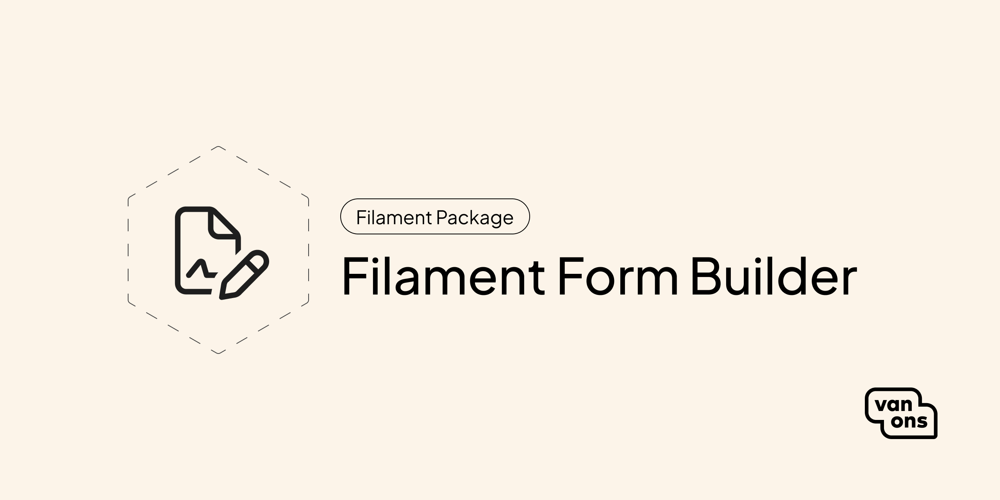

<p align="center" class="filament-hidden"></p>

# Filament Form Builder

[](https://github.com/VanOns/filament-form-builder/releases)
[](https://packagist.org/packages/van-ons/filament-form-builder)
[](https://github.com/VanOns/filament-form-builder/issues)
[](https://github.com/VanOns/filament-form-builder/blob/main/LICENSE.md)

Add a customizable form builder to your Filament admin panel.

## Quick start

> For Filament version compatibility, see [Compatibility](docs/compatibility.md).

### Installation

Start by installing the package via Composer:

```bash
composer require van-ons/filament-form-builder:^1.0
```

Next, publish and run the migrations:

```bash
php artisan vendor:publish --tag=filament-form-builder-migrations
php artisan migrate
```

Finally, add the plugin to your Filament panel provider:

```php
use Filament\Panel;
use Filament\PanelProvider;
use VanOns\FilamentFormBuilder\FilamentFormBuilderPlugin;

class AdminPanelProvider extends PanelProvider
{
    public function panel(Panel $panel): Panel
    {
        return $panel->plugin(FilamentFormBuilderPlugin::make());
    }
}
```

## Documentation

Please see the [documentation](docs) for detailed information about installation and usage.

## Contributing

Please see [Contributing](CONTRIBUTING.md) for more information about how you can contribute.

## Testing

```bash
composer test
```

## Changelog

Please see [Changelog](CHANGELOG.md) for more information about what has changed recently.

## Upgrading

Please see [Upgrading](UPGRADING.md) for more information about how to upgrade.

## Security

Please see [Security](SECURITY.md) for more information about how we deal with security.

## Credits

We would like to thank the following contributors for their contributions to this project:

- [All contributors](../../contributors)

## License

The scripts and documentation in this project are released under the [MIT License](LICENSE.md).

---

<p align="center"><a href="https://van-ons.nl/" target="_blank"></a></p>
